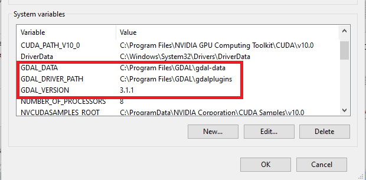
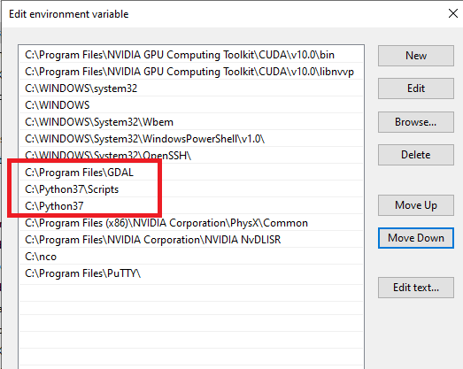

# Debugger

Here is a list of all possible error you can encounter. If you encounter a new error, please report an issue in the repository and I will include that too. Afterall, it is always the community that makes open-source efforts possible.

## Alternative Installation

1. [Python and GDAL Installation Automated for Windows 10](https://towardsdatascience.com/python-and-gdal-installation-automated-for-windows-10-f22686595447)
2. [Installing GDAL for Windows](https://sandbox.idre.ucla.edu/sandbox/tutorials/installing-gdal-for-windows)
    1. [GISInternals - GDAL](https://www.gisinternals.com/)
    2. [Python Extension Packages - GDAL and Rasterio](https://www.lfd.uci.edu/~gohlke/pythonlibs/#gdal)

## Problems

### Can't load requested DLL: C:\Program Files\GDAL\gdalplugins\ogr_MSSQLSpatial.dll

[Solution](https://gis.stackexchange.com/questions/321693/dll-error-in-various-gdal-installations): remove file ogr_MSSQLSpatial.dll.

### Can't load requested DLL: C:\Program Files\GDAL\gdalplugins\gdal_KEA.dll

[Solution](https://gis.stackexchange.com/questions/321693/dll-error-in-various-gdal-installations): remove file gdal_KEA.dll.

### ModuleNotFoundError: No module named '_gdal'

This error is likely when the paths were somehow not added to the system variables.

